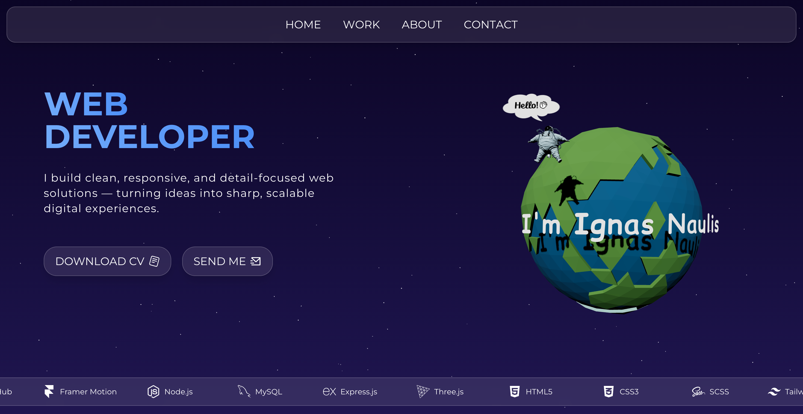
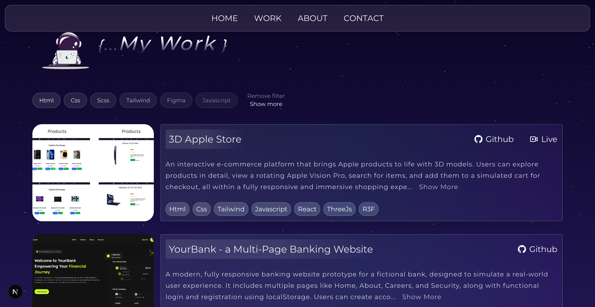
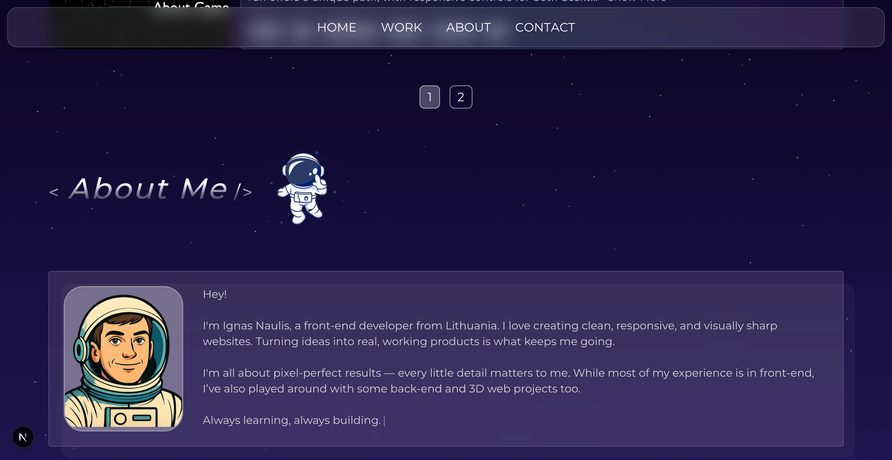
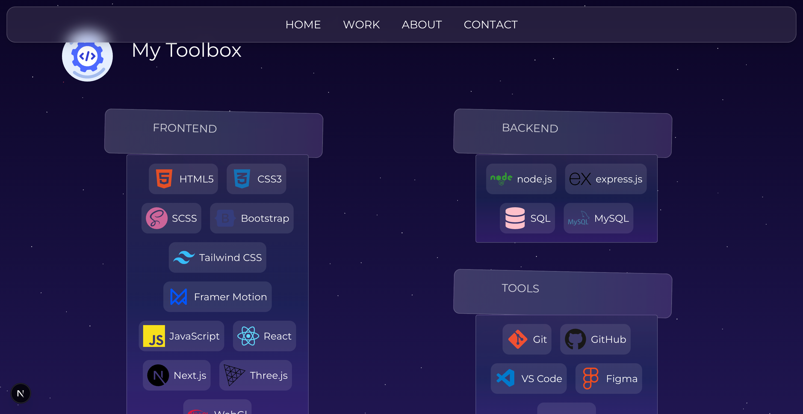
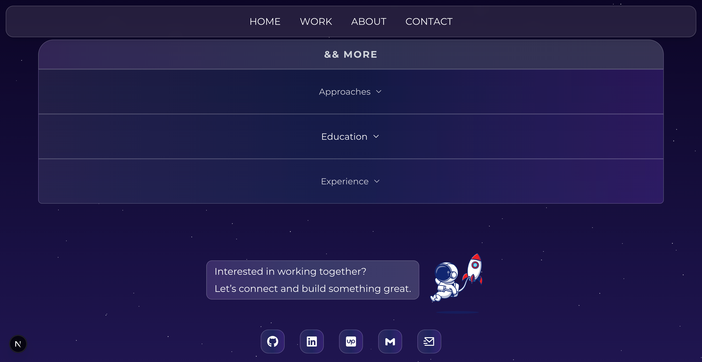

# Portfolio – Interactive 3D & Modern Web Experience

An interactive and modern portfolio website where I showcase my work and introduce myself through a visually engaging and animated interface. The project features integrated 3D models and is fully responsive, built with modern web technologies to highlight both technical skills and creativity.

## [>Visit My Portfolio<](https://www.ignas-naulis.dev/)

## 🚀 Tech Stack

- **Next.js** – React framework for server-side rendering and static site generation  
- **React** – UI library  
- **Three.js** – 3D graphics engine  
- **React Three Fiber (R3F)** – React renderer for Three.js  
- **TailwindCSS** – Utility-first CSS framework for styling  
- **Framer Motion** – Animation library for React  
- **Lottie React** – For rendering Lottie animations  
- **React Icons** – Icon library  
- **React Intersection Observer** – For observing elements in viewport  
- **React Simple Typewriter** – Typewriter effect component  

---

## 💡 Features

- 🎨 **Modern & Interactive Design**: Visually engaging and animated interface to showcase work and skills  
- 🧩 **Integrated 3D Models**: Interactive 3D elements using React Three Fiber and Three.js  
- 🚀 **Smooth Animations**: Powered by Framer Motion and Lottie React for lively effects  
- 📱 **Fully Responsive**: Optimized layout for mobile, tablet, and desktop using TailwindCSS  
- ✨ **Typewriter Effect**: Animated text introduction using React Simple Typewriter  
- 🔍 **Viewport Detection**: Elements animate on scroll with React Intersection Observer  
- 🔧 **Built with Next.js**: Fast, SEO-friendly React framework with server-side rendering  
- 🎨 **Iconography**: Rich icon support using React Icons  

---

## 📦 Dependencies

```json
{
  "@react-three/drei": "^10.0.7",
  "@react-three/fiber": "^9.1.2",
  "framer-motion": "^12.11.0",
  "lottie-react": "^2.4.1",
  "next": "15.3.2",
  "react": "^19.0.0",
  "react-dom": "^19.0.0",
  "react-icons": "^5.5.0",
  "react-intersection-observer": "^9.16.0",
  "react-simple-typewriter": "^5.0.1",
  "three": "^0.176.0"
}

```

---

## 📸 Screenshots







---

## 🛠️ Installation & Usage

1. **Clone the repository**  
   ```bash
   git clone https://github.com/Ignaulis/portfolio.git
   ```

2. **Install dependencies**  
   ```bash
   npm install
   ```

3. **Start the development server**  
   ```bash
   npm run dev
   ```


---

## 📝 License

This project is open source and available under the [MIT License](LICENSE).
