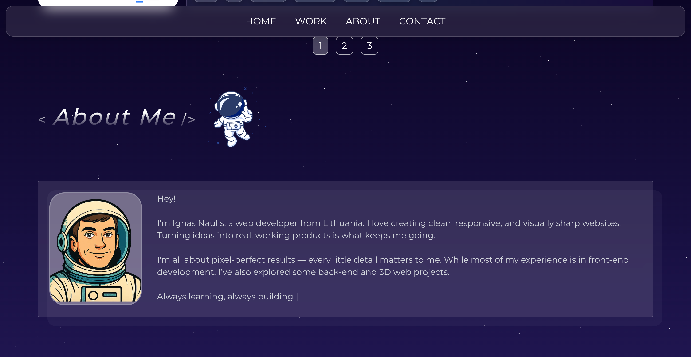

# Portfolio – Interactive 3D & Modern Web Experience

An interactive and modern portfolio website where I showcase my work and introduce myself through a visually engaging and animated interface. The project features integrated 3D models and is fully responsive, built with modern web technologies to highlight both technical skills and creativity.

## [Check out!](https://ignaulis.github.io/3d_apple_store/)

---

## 🚀 Tech Stack

- **Next.js** – React framework for server-side rendering and static site generation  
- **React** – UI library  
- **Three.js** – 3D graphics engine  
- **React Three Fiber (R3F)** – React renderer for Three.js  
- **TailwindCSS** – Utility-first CSS framework for styling  
- **Framer Motion** – Animation library for React  
- **Lottie React** – For rendering Lottie animations  
- **React Icons** – Icon library  
- **React Intersection Observer** – For observing elements in viewport  
- **React Simple Typewriter** – Typewriter effect component  

---

## 💡 Features

- 🧠 **Immersive 3D Models**: Seamlessly integrated interactive 3D product models using React Three Fiber and Three.js  
- 🔁 **Landing Page**: Rotating 3D Apple Vision Pro and a slider showcasing the latest products  
- 🌐 **Responsive Navigation Bar**: Links to iPhone, Mac, Vision, Contacts, Search, and Cart  
- 🧭 **Product Exploration**:  
  - View all products as image cards  
  - Navigate to detailed product pages featuring 3D models  
  - Add products to cart from any page  
- 🔍 **Search Functionality**: Instant filtering of products by name  
- 🛒 **Cart & Checkout Simulation**:  
  - Add products to your cart  
  - Simulate a purchase with user information input  
- 📱 **Fully Responsive Design**: Mobile, tablet, and desktop friendly, styled with TailwindCSS  
- 🚀 **Built with Modern Tech**: React, React Three Fiber, Drei, TailwindCSS, Vite, and React Router DOM  

---

## 📦 Dependencies

```json
{
  "@react-three/drei": "^10.0.6",
  "@react-three/fiber": "^9.1.2",
  "@tailwindcss/vite": "^4.1.4",
  "react": "^19.0.0",
  "react-dom": "^19.0.0",
  "react-router-dom": "^7.5.1",
  "tailwindcss": "^4.1.4",
  "three": "^0.175.0",
  "vite-plugin-svgr": "^4.3.0"
}
```

## 📸 Screenshots





---

## 🛠️ Installation & Usage

1. **Clone the repository**  
   ```bash
   git clone https://github.com/yourusername/3d-apple-store.git
   ```

2. **Install dependencies**  
   ```bash
   npm install
   ```

3. **Start the development server**  
   ```bash
   npm run dev
   ```


---

## 📝 License

This project is open source and available under the [MIT License](LICENSE).
